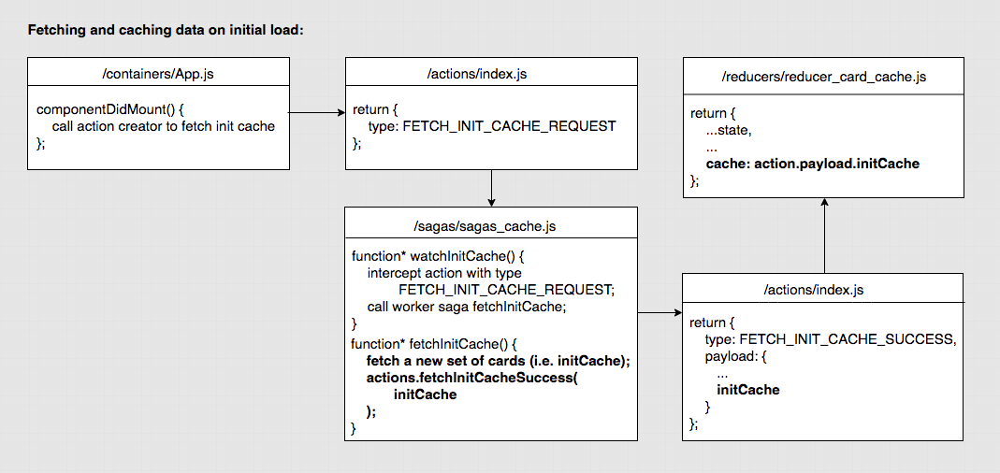
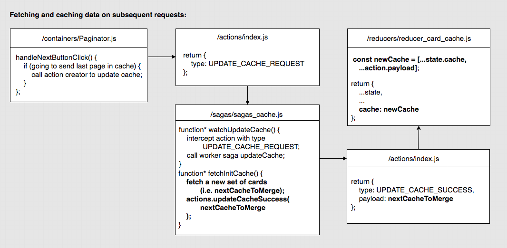

# paginated-cache   

This front-end app displays a set of cards on each page, allows a user to see the previous or next page of cards by clicking on a button, and shows the details of a specific card when a user clicks on it. 

Featuring local cache, this app provides seamless pagination as well as a loading indication when the page requested is being cached. 

## Instructions to run the app locally

#### Change to your working directory, for example,

`$ cd projects`

#### Clone and go to this repository

`$ git clone https://github.com/eviema/paginated-cache.git`

`$ cd paginated-cache`

#### Install dependencies

`$ npm install`

#### Run the app in the development mode
`$ npm start`

You will now be directed to [http://localhost:3000](http://localhost:3000) to view the app in the browser.

The page will reload if you make edits.

You will also see any lint errors in the console.

To launch the test runner in the interactive watch mode, run 

`npm test`.

See the section about [running tests](https://facebook.github.io/create-react-app/docs/running-tests) for more information.

## Technology stack
- Create React App
- Material UI
- Redux
- Redux Saga
- Enzyme + Jest

## /src structure *UPDATED*

<details>
    <summary>/actions</summary>
    <ul>
        <li>
            <details>
                <summary>/__tests__</summary>
                <ul>
                    <li>actions.test.js</li>
                </ul>
            </details>
        </li>
        <li>index.js</li>
    </ul>    
</details>

<details>
    <summary>/api</summary>
    <ul>
        <li>cache.js</li>
    </ul>
</details>

<details>
    <summary>/assets</summary>
    <ul>
        <li>loading_spinner.gif</li>
        <li>cloud_off.png</li>
    </ul>
</details>

<details>
    <summary>/components</summary>
    <ul>
        <li>
            <details>
                <summary>/__tests__</summary>
                <ul>
                    <li>SingleCard.test.js</li>
                    <li>Loading.test.js</li>
                </ul>
            </details>
        </li>
        <li>SingleCard.js</li>
        <li>Loading.js</li>
    </ul>    
</details>

<details>
    <summary>/containers</summary>
    <ul>
        <li>
            <details>
                <summary>/__tests__</summary>
                <ul>
                    <li>App.test.js</li>
                    <li>CardDrawer.test.js</li>
                    <li>CardSet.test.js</li>
                    <li>Paginator.test.js</li>
                </ul>
            </details>
        </li>
        <li>App.js</li>
        <li>CardDrawer.js</li>
        <li>CardSet.js</li>
        <li>ErrorPage.js</li>
        <li>Paginator.js</li>
    </ul>    
</details>

<details>
    <summary>/reducers</summary>
    <ul>
        <li>
            <details>
                <summary>/__tests__</summary>
                <ul>
                    <li>active_card_set.test.js</li>
                    <li>active_card.test.js</li>
                    <li>card_cache.test.js</li>
                    <li>loading.test.js</li>
                    <li>page_numbers.test.js</li>
                </ul>
            </details>
        </li>
        <li>index.js</li>
        <li>reducer_active_card_set.js</li>
        <li>reducer_active_card.js</li>
        <li>reducer_card_cache.js</li>
        <li>reducer_loading.js</li>
        <li>reducer_page_numbers.js</li>
    </ul>    
</details>

<details>
    <summary>/sagas</summary>
    <ul>
        <li>index.js</li>
        <li>helper.js</li>
        <li>sagas_cache.js</li>
        <li>sagas_card_set.js</li>
    </ul>
</details>   

index.js   
Root.js   
setupTests.js   

## Data fetching and caching *UPDATED*




#### Caching algorithm

***Update:***  
Card cache core structure:
```
[
    {
        pageNumberInCache: 1,
        cardsOnPage: [
            {card 1},
            {card 2},
            ...
            {card 12}
        ]
    },
    {
        pageNumberInCache: 2,
        cardsOnPage: [
            {card 1},
            {card 2},
            ...
            {card 12}
        ]
    },
    ...
]
```
---

Caching occurs when the app initially loads or when a user clicks to go to the second last page in current cache.

In both cases, an action creator will be called to request caching. The action returned will be intercepted by a watcher saga, and the paired worker saga will process the request and fetch a new set of cards. 

If the app loads for the first time, the new set of cards will be set as current cache in application state. 

If a user is close to the end of cached data, the new card set will be concatenated with current cache as the next version of current cache. 

#### Fetching algorithm

Fetching data occurs right before caching takes place.

On initial load, an action creator will be called to initialise cache. A watcher saga intercepts the action returned, and a paird worker saga fetches 4 pages of cards (i.e. 48 cards) via an API call. The API call uses `axios` with configured parameters (e.g. page = 0, perPage = 48). After the response is received, the actual data inside will be extracted, processed and passed to another action creator for initial caching. 

***Update:*** 

For each subsequent caching request, 8 pages of cards (i.e. 96 cards) are fetched in the worker saga via one API call, with configured parameters. The parameters are determined given the page number requested by user and an artificial rule that data in endpoint is split as 96 cards per page. In the API call, the group of 96 cards where the page requested falls in is retrieved. Then relevant card data in the response will be extracted, processed and passed to another action creator for a cache update.
 

## Total time taken to build the app *UPDATED*

***Update:*** 4 more hours spent on modifying fetching and caching algorithms and related code

34 hours, including:
- 2 hours on initial analysis and design,
- 27 hours on app development
- 5 hours on unit testing

